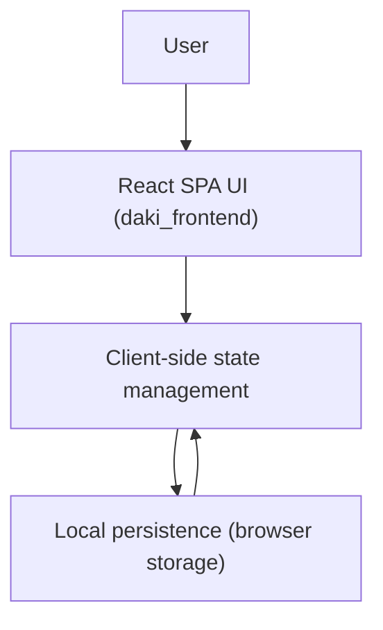

# DAKI Notes App Architecture

## Purpose and scope

This document describes the architecture of the DAKI Notes app as defined by the current Product Requirements Document (PRD) and intended implementation approach. DAKI is a single-page React web application that runs entirely in the browser and persists user data locally. There is no backend service and no separate database container.

This architecture description focuses on the runtime structure, major frontend modules, and the data persistence approach required to satisfy the PRD’s functional and non-functional requirements.

## Architectural overview

DAKI is implemented as a single React frontend container (`daki_frontend`) that renders the full user experience and manages note data lifecycle within the browser. The app loads notes from browser storage at startup, maintains an in-memory representation of notes while the app is running, and writes updates back to browser storage as the user creates, edits, or deletes notes.

There are no network calls required for core product functionality, and the app must not transmit notes to any server.

### High-level diagram

## Containers and deployment model

### Frontend container: `daki_frontend`

The `daki_frontend` container is a React application built with Create React App tooling (`react-scripts`). In development it runs on port 3000. It contains the UI, the note editor interactions, local persistence logic, and client-side search filtering.

There is intentionally no backend container and no database container in this work item. Any future introduction of a backend or remote persistence would be an explicit scope change and must be requested separately.

## Frontend component architecture

The UI is expected to follow the PRD’s layout and interaction model: a header with app title and search input, a notes list, and an editor for the selected note, plus a floating action button (FAB) to add notes. On smaller screens, the layout must adapt to remain usable and keep core flows accessible.

A practical internal structure for the React app is to separate concerns into UI components, state/data logic, and persistence utilities. Even if the source code is reorganized over time, the logical responsibilities should remain consistent.

### Suggested module boundaries (logical responsibilities)

#### UI layer

The UI layer is responsible for rendering and interaction handling, but it should avoid owning persistence details. It should generally receive data and callbacks from the state layer.

In PRD terms, the UI includes:
- A header with the “DAKI” title and a search input.
- A notes list that shows summary information and supports selection and delete actions.
- A note editor for editing the currently selected note.
- A FAB that creates a new note and moves focus into the editor.

#### State and domain logic

The state layer is responsible for:
- Holding the active notes collection and the selected note identifier.
- Applying modifications to notes (create, update, delete).
- Deriving a filtered/sorted notes list based on search input and “last updated” ordering expectations.
- Coordinating persistence reads on startup and persistence writes when changes occur.

The state can be implemented using React state hooks, reducers, or context. The key architectural requirement is that state changes remain immediate and are persisted reliably.

#### Persistence layer

The persistence layer is responsible for:
- Loading notes on startup from browser storage.
- Validating and safely parsing stored data.
- Writing changes back to storage on create/edit/delete.
- Recovering to an empty state if storage is missing or contains unexpected/corrupted content.

The PRD allows “browser storage mechanisms.” The typical approach is `localStorage` for simplicity. If `localStorage` is used, writes should be throttled or debounced if necessary to avoid excessive synchronous writes during rapid typing, while still ensuring data is not lost during normal use.

## Data model

Per the PRD, a note must have at minimum:
- A unique identifier.
- A title (user-entered or derived from content).
- A body/content (free text).
- Timestamps sufficient to support sorting and user expectations, such as last updated time.

This is a conceptual model and does not mandate a specific schema. A typical browser storage representation is a single JSON payload containing an array of notes, for example:

- `id`: string
- `title`: string
- `content`: string
- `createdAt`: ISO timestamp string or epoch milliseconds
- `updatedAt`: ISO timestamp string or epoch milliseconds

The architecture expects the list view to sort by “most recently updated first,” which implies `updatedAt` must be maintained consistently.

## Key flows

### App startup

On app startup, the frontend must load notes from browser storage, normalize them into an internal representation, and render:
- The notes list (possibly empty).
- An editor area reflecting either the selected note or an empty state.

If stored data is not present or cannot be parsed safely, the app must recover gracefully to an empty list and continue functioning.

### Create note

When the user triggers note creation using the FAB:
- A new note is created in memory with a unique id and timestamps.
- The new note is inserted into the notes collection and becomes selected immediately.
- The editor is focused so the user can start typing.
- The updated notes collection is persisted locally.

### Edit note

When the user edits the selected note:
- The editor reflects changes immediately.
- The notes list updates any preview information derived from the note (title/preview text and last updated time).
- Changes are persisted locally so that a refresh retains edits.

### Delete note

When the user deletes a note:
- The note is removed from the notes collection and from local persistence.
- The UI transitions to a valid next state (for example, select the next most recent note, or show an empty editor if the last note was removed).
- If confirmation is used, it must remain clear and workable on mobile.

### Search notes

Search is client-side and filters the notes list based on the search query. The PRD requires searching across both titles and content “conceptually,” which implies the filter predicate should check both fields. Search should feel responsive and should produce a clear empty state when no matches are found.

## Non-functional considerations

### Performance

Because all operations are local and in-memory, responsiveness is primarily determined by render efficiency and search filtering cost. For a moderate personal number of notes, list filtering and sorting should remain fast. If needed, the architecture can use memoization and debouncing of search input to keep interaction smooth.

### Reliability and data safety

Local persistence must be treated as untrusted input. The persistence layer should:
- Handle missing keys and parse errors without crashing.
- Default to an empty state on invalid data.
- Avoid partial writes when possible by writing complete serialized state.

### Accessibility

The architecture should support accessible UI patterns:
- Search input should have an explicit label (visual or aria-label).
- Buttons (FAB, delete, theme toggle if present) should be keyboard focusable and labeled.
- Focus management should support “create note then type immediately” by moving focus to the editor.

### Security and privacy

All notes remain local to the user’s browser. The architecture must not depend on network services for storing or retrieving note data, and it must not transmit notes off-device.

## Alignment with the PRD

This architecture is explicitly aligned with the PRD requirements that DAKI:
- Is a single React frontend container (`daki_frontend`).
- Implements create/edit/delete/list/search for notes.
- Provides a responsive UI with header + search, list, editor, and FAB.
- Persists notes locally with safe startup loading behavior.
- Avoids backend services, user accounts, or cloud sync.

## Source references

This document is informed by the PRD and the current repository structure, including the React frontend container configuration.
